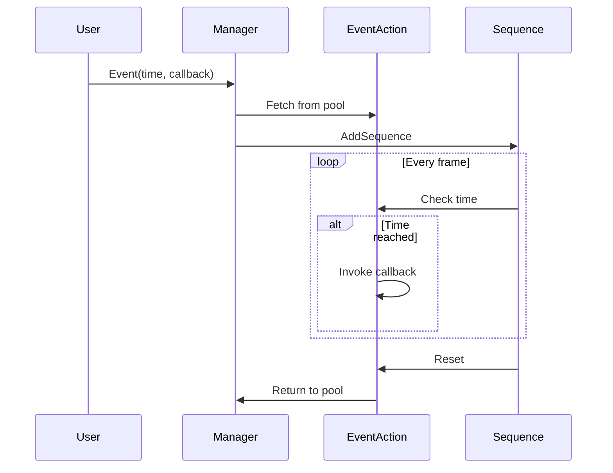

# ActionSequence 事件系统

## 简介

事件系统是ActionSequence的扩展功能，允许你在时间线的特定时间点触发事件。这是一个轻量级、高性能的解决方案，完美集成到现有的ActionSequence架构中。

## 核心特性

✅ **零持续时间触发** - 事件在精确的时间点瞬时触发  
✅ **类型安全** - 支持泛型参数传递  
✅ **对象池优化** - 自动内存管理，零GC  
✅ **异常安全** - 内置异常捕获，不影响其他事件  
✅ **Unity集成** - 支持UnityEvent，可在编辑器中配置  
✅ **流式API** - 提供EventSequenceBuilder，代码清晰易读  
✅ **调试友好** - 支持事件命名和日志输出  

## 快速开始

### 基础用法

```csharp
using ActionSequence;
using UnityEngine;

public class QuickStart : MonoBehaviour
{
    void Start()
    {
        var manager = ActionSequences.GetDefaultActionSequenceManager();
        
        // 简单事件
        manager.Event(1f, () => Debug.Log("Hello!"));
        
        // 带参数的事件
        manager.Event<string>(2f, (msg) => Debug.Log(msg), "World!");
        
        // 事件序列
        manager.CreateEventSequence()
            .AddEvent(0f, () => Debug.Log("Start"))
            .AddEvent(1f, () => Debug.Log("Middle"))
            .AddEvent(2f, () => Debug.Log("End"))
            .BuildAndPlay();
    }
}
```

### Unity编辑器使用

1. 添加 `ActionSequenceComponent` 到GameObject
2. 在Inspector中添加 `EventClipData`
3. 配置事件时间和UnityEvent回调
4. 运行时调用 `Play()`

## 架构设计

### 组件结构

```
EventAction (Runtime/Actions/)
├── EventAction          - 无参数事件动作
└── EventAction<T>       - 泛型事件动作

EventExtensions (Extensions/)
├── Event()              - 快捷方法
├── Event<T>()           - 泛型快捷方法
└── EventSequenceBuilder - 流式构建器

EventClipData (UnityComponents/UnityData/)
├── EventClipData        - 基础事件数据
├── StringEventClipData  - 字符串事件
├── IntEventClipData     - 整数事件
├── FloatEventClipData   - 浮点数事件
└── BoolEventClipData    - 布尔事件
```

### 工作流程



## API概览

### EventExtensions

| 方法 | 描述 | 返回值 |
|------|------|--------|
| `Event(float, Action, string)` | 触发简单事件 | ActionSequence |
| `Event<T>(float, Action<T>, T, string)` | 触发带参数事件 | ActionSequence |
| `CreateEventSequence()` | 创建事件构建器 | EventSequenceBuilder |

### EventSequenceBuilder

| 方法 | 描述 | 返回值 |
|------|------|--------|
| `SetId(string)` | 设置序列ID | this |
| `SetOwner(object)` | 设置所有者 | this |
| `SetParam(object)` | 设置参数 | this |
| `AddEvent(float, Action, string)` | 添加事件 | this |
| `AddEvent<T>(float, Action<T>, T, string)` | 添加泛型事件 | this |
| `AddAction(float, float, IAction)` | 添加动作 | this |
| `Build()` | 构建序列 | ActionSequence |
| `BuildAndPlay()` | 构建并播放 | ActionSequence |

### EventAction

| 方法 | 描述 |
|------|------|
| `SetCallback(Action)` | 设置回调 |
| `SetEventName(string)` | 设置事件名 |
| `SetEventData(object)` | 设置事件数据 |

## 使用场景

### 1. 游戏逻辑

```csharp
// 技能释放序列
manager.CreateEventSequence()
    .AddEvent(0f, () => PlayAnimation("Cast"))
    .AddEvent(0.5f, () => SpawnEffect())
    .AddEvent(1f, () => DealDamage(100))
    .BuildAndPlay();
```

### 2. UI动画

```csharp
// 面板显示动画
manager.CreateEventSequence()
    .AddEvent(0f, () => panel.SetActive(true))
    .AddEvent(0.2f, () => ShowTitle())
    .AddEvent(0.4f, () => ShowButtons())
    .BuildAndPlay();
```

### 3. 过场动画

```csharp
// 剧情序列
manager.CreateEventSequence()
    .AddEvent(0f, () => DisablePlayerControl())
    .AddEvent(1f, () => PlayDialogue("line1"))
    .AddEvent(5f, () => PlayDialogue("line2"))
    .AddEvent(10f, () => EnablePlayerControl())
    .BuildAndPlay();
```

### 4. 音效触发

```csharp
// 音效序列
manager.CreateEventSequence()
    .AddEvent(0f, () => PlaySound("footstep"))
    .AddEvent(0.5f, () => PlaySound("footstep"))
    .AddEvent(1f, () => PlaySound("footstep"))
    .BuildAndPlay();
```

## 性能特性

### 内存优化

- ✅ 对象池自动管理
- ✅ 零GC分配（复用对象）
- ✅ 及时清理引用

### CPU优化

- ✅ 轻量级时间检查
- ✅ 无锁对象池
- ✅ 最小化虚函数调用

### 异常处理

- ✅ 内置try-catch
- ✅ 错误日志输出
- ✅ 不影响其他事件

## 与现有系统对比

| 特性 | ActionSequence事件系统 | Unity Coroutine | DOTween Callbacks |
|------|----------------------|-----------------|-------------------|
| 精确时间控制 | ✅ | ⚠️ | ✅ |
| 对象池优化 | ✅ | ❌ | ⚠️ |
| 类型安全 | ✅ | ❌ | ⚠️ |
| 编辑器集成 | ✅ | ❌ | ❌ |
| 异常安全 | ✅ | ❌ | ⚠️ |
| 流式API | ✅ | ❌ | ✅ |
| 学习曲线 | 低 | 低 | 中 |

## 扩展性

### 自定义事件类型

```csharp
// 创建自定义事件动作
public class CustomEventAction : IAction, IStartAction, IPool
{
    public CustomData Data { get; set; }
    
    public void Start()
    {
        // 自定义逻辑
    }
    
    public void Reset() { /* ... */ }
    public bool IsFromPool { get; set; }
}

// 创建对应的ClipData
[Serializable]
public class CustomEventClipData : AActionClipData<CustomEventAction>
{
    public CustomData data;
    
    public void ApplyTo(CustomEventAction action)
    {
        action.Data = data;
    }
}
```

### 自定义扩展方法

```csharp
public static class MyEventExtensions
{
    public static ActionSequence PlaySoundEvent(
        this ActionSequenceManager manager,
        float time,
        AudioClip clip)
    {
        return manager.Event(time, () => 
        {
            AudioSource.PlayClipAtPoint(clip, Vector3.zero);
        }, $"PlaySound_{clip.name}");
    }
}
```

## 最佳实践

### ✅ 推荐做法

```csharp
// 1. 使用有意义的事件名称
manager.Event(1f, OnBossSpawn, "BossSpawn");

// 2. 使用构建器创建复杂序列
manager.CreateEventSequence()
    .SetId("ComplexSequence")
    .AddEvent(0f, OnStart)
    .AddEvent(1f, OnMiddle)
    .AddEvent(2f, OnEnd)
    .BuildAndPlay();

// 3. 使用泛型避免闭包陷阱
for (int i = 0; i < 10; i++)
{
    manager.Event<int>(i, (index) => Debug.Log(index), i);
}

// 4. 正确清理资源
void OnDestroy()
{
    sequence?.Kill();
}
```

### ❌ 避免做法

```csharp
// 1. 不要在事件中执行耗时操作
manager.Event(1f, () => 
{
    for (int i = 0; i < 1000000; i++) { /* 阻塞 */ }
});

// 2. 不要捕获循环变量
for (int i = 0; i < 10; i++)
{
    manager.Event(i, () => Debug.Log(i)); // 错误！
}

// 3. 不要忘记清理
void OnDestroy()
{
    // 忘记调用 sequence?.Kill();
}
```

## 文档资源

- 📖 [事件系统指南](./guides/event-system-guide.md) - 详细使用说明
- 💡 [事件系统示例](./examples/06-event-system-examples.md) - 实际应用案例
- 🔧 [API参考](./api/README.md) - 完整API文档
- 🏗️ [架构设计](./architecture.md) - 系统架构说明

## 版本历史

### v1.0.0 (当前版本)
- ✅ 基础事件系统
- ✅ 泛型事件支持
- ✅ EventSequenceBuilder
- ✅ Unity编辑器集成
- ✅ 对象池优化
- ✅ 异常处理

### 未来计划
- 🔜 动态事件插入
- 🔜 事件优先级
- 🔜 事件过滤器
- 🔜 事件录制和回放

## 贡献

欢迎提交Issue和Pull Request来改进事件系统！

## 许可证

与ActionSequence主项目保持一致。

---

**快速链接**：
- [返回主文档](./index.md)
- [快速开始](./getting-started.md)
- [API参考](./api/README.md)
- [示例代码](./examples/README.md)
