# ActionSequence 系统架构概览

## 目录

- [系统简介](#系统简介)
- [整体架构](#整体架构)
- [分层架构](#分层架构)
- [核心组件](#核心组件)
- [数据流](#数据流)
- [生命周期管理](#生命周期管理)
- [扩展机制](#扩展机制)
- [性能优化策略](#性能优化策略)

## 系统简介

ActionSequence 是一个为 Unity 游戏引擎设计的高性能时间线动作序列系统。它提供了一套完整的解决方案，用于创建、编排和执行基于时间的动作序列，广泛应用于：

- **动画编排**: 复杂的动画序列和过渡效果
- **UI 动画**: 界面元素的动态效果和交互反馈
- **游戏逻辑**: 技能释放、事件触发、过场动画
- **时间控制**: 精确的时间编排和播放控制

### 核心特性

- ✅ **高性能**: 对象池优化，减少 GC 压力
- ✅ **灵活扩展**: 基于接口的动作系统
- ✅ **可视化编辑**: Unity 编辑器集成
- ✅ **精确控制**: 亚帧级别的时间精度
- ✅ **易于使用**: 简洁的 API 和链式调用

## 整体架构

ActionSequence 系统采用**三层架构设计**，从底层到上层分别是：核心层、Unity 集成层和扩展层。

### 架构全景图

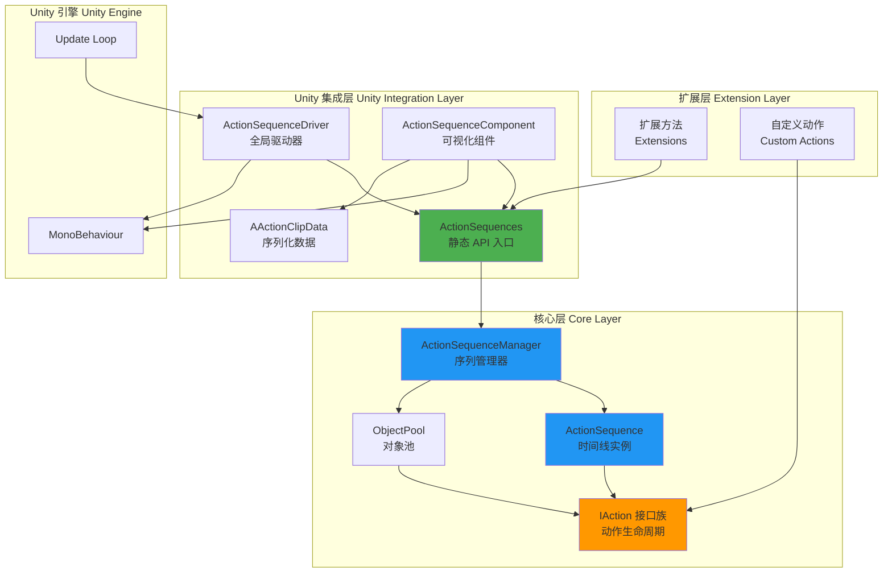

### 层次职责概览

| 层次 | 职责 | 主要组件 |
|------|------|----------|
| **扩展层** | 提供便捷的扩展方法和自定义动作实现 | Extensions, Custom Actions |
| **Unity 集成层** | Unity 引擎集成、可视化编辑、生命周期管理 | ActionSequences, Driver, Component |
| **核心层** | 时间线执行引擎、对象池管理、动作接口定义 | Manager, Sequence, Pool, IAction |

## 分层架构

### 1. 核心层 (Core Layer)

核心层是系统的基础，提供与平台无关的时间线执行引擎和对象管理功能。

#### 组件关系图

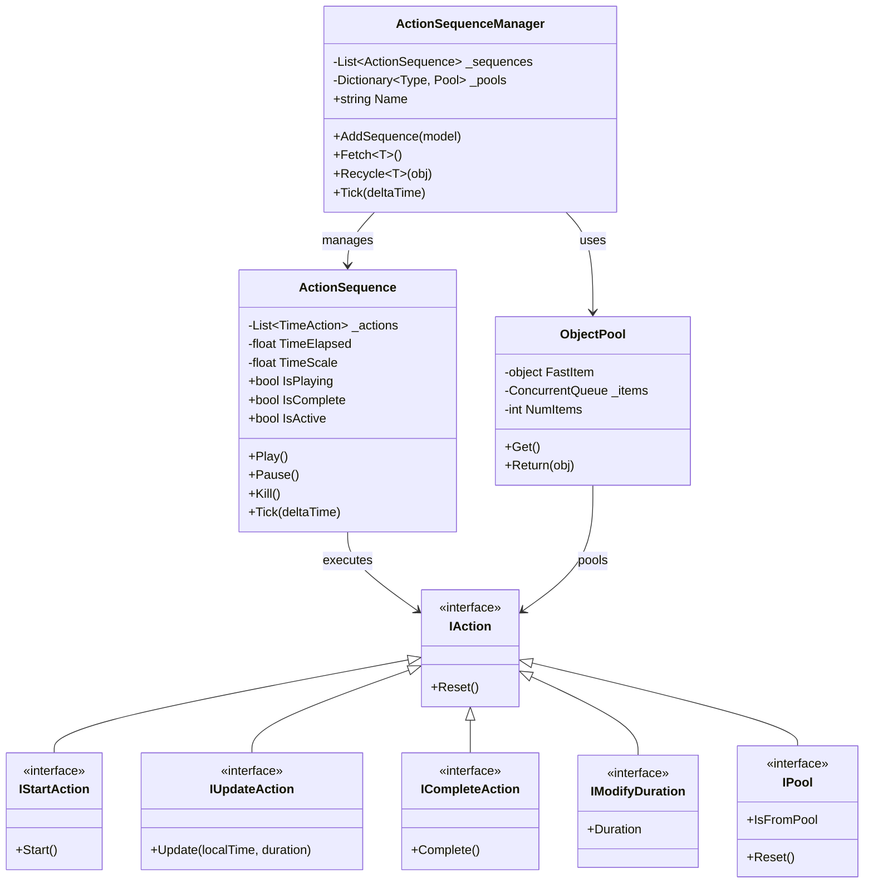

#### 职责说明

**IAction 接口族**
- 定义动作的生命周期接口
- 支持可选实现（接口组合模式）
- 提供类型安全的参数传递

**ActionSequence (时间线实例)**
- 管理一组按时间排列的动作
- 精确控制动作的执行时机
- 提供播放控制（播放、暂停、停止）
- 支持时间缩放和状态查询

**ActionSequenceManager (序列管理器)**
- 管理多个 ActionSequence 的生命周期
- 提供统一的对象池服务
- 每帧更新所有活动序列
- 自动回收完成的序列

**ObjectPool (对象池)**
- 线程安全的对象复用机制
- 无锁优化（FastItem 快速路径）
- 类型隔离和容量限制
- 减少 GC 压力

### 2. Unity 集成层 (Unity Integration Layer)

Unity 集成层将核心功能与 Unity 引擎深度集成，提供可视化编辑和生命周期管理。

#### 组件关系图

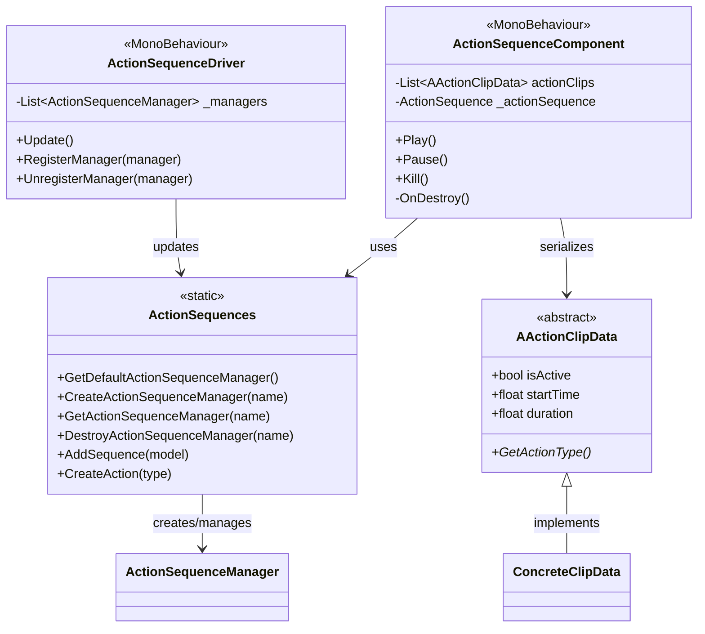

#### 职责说明

**ActionSequences (静态 API)**
- 全局访问入口点
- 管理多个命名的 Manager
- 提供便捷的创建方法
- 初始化和清理系统资源

**ActionSequenceDriver (全局驱动器)**
- MonoBehaviour 生命周期集成
- 每帧驱动所有 Manager 更新
- DontDestroyOnLoad 持久化
- 自动初始化

**ActionSequenceComponent (可视化组件)**
- 在 Inspector 中编辑序列
- 序列化动作配置
- 组件生命周期管理
- 提供测试播放功能

**AActionClipData (序列化数据)**
- Unity 可序列化的动作数据基类
- 支持多态序列化
- 编辑器显示定制
- 类型映射机制

### 3. 扩展层 (Extension Layer)

扩展层提供便捷的扩展方法和自定义动作实现示例。

#### 扩展机制

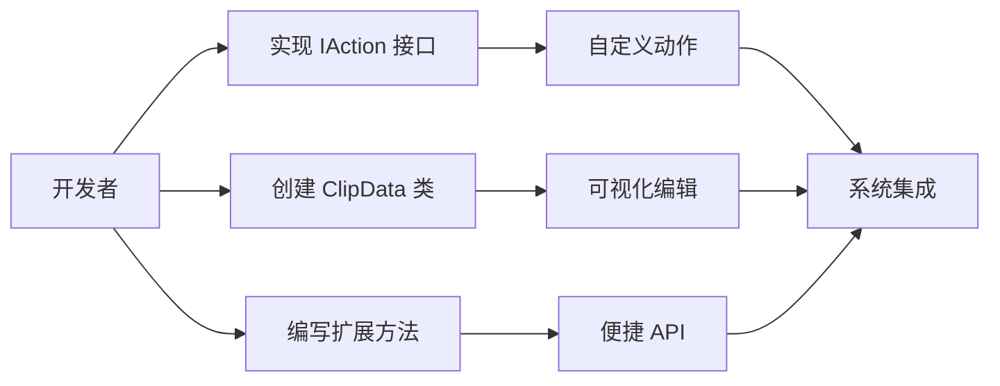

#### 职责说明

**扩展方法**
- 为 Unity 组件添加便捷方法
- 简化常见操作
- 提供领域特定 API

**自定义动作**
- 实现项目特定功能
- 复用系统基础设施
- 保持一致的接口

## 核心组件

### 组件详细说明

#### 1. ActionSequence - 时间线实例

**核心职责**: 执行一组按时间排列的动作

**关键属性**:
```csharp
public class ActionSequence : IPool
{
    // 状态属性
    public bool IsPlaying      // 是否正在播放
    public bool IsComplete     // 是否已完成
    public bool IsActive       // 是否活动（未被回收）
    
    // 时间控制
    public float TimeScale     // 时间缩放（最小 0.1）
    public float TimeElapsed   // 已过时间
    public float TotalDuration // 总持续时间
    
    // 上下文
    public string Id           // 序列标识
    public object Owner        // 所有者对象
    public object Param        // 参数对象
}
```

**状态机**:
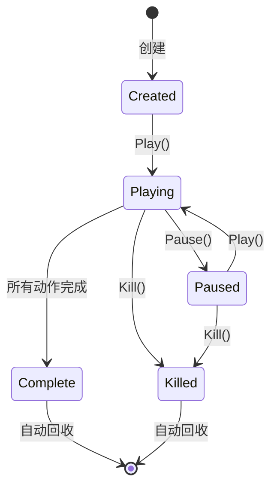

#### 2. ActionSequenceManager - 序列管理器

**核心职责**: 管理序列生命周期和对象池

**工作流程**:
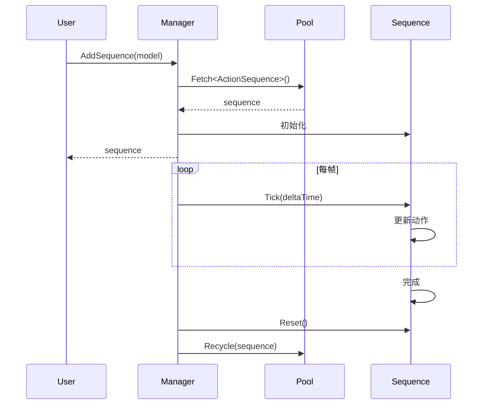

#### 3. ObjectPool - 对象池

**核心职责**: 高性能对象复用

**无锁优化**:
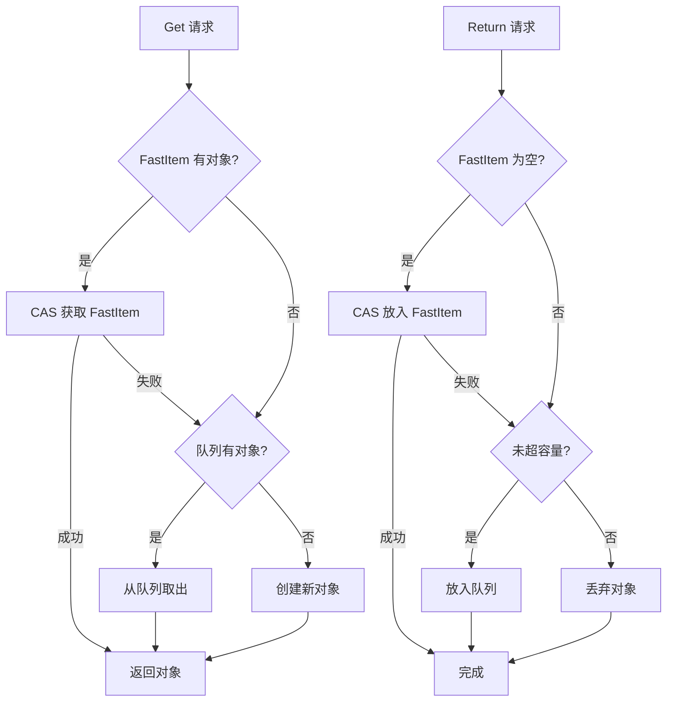

## 数据流

### 创建和执行流程

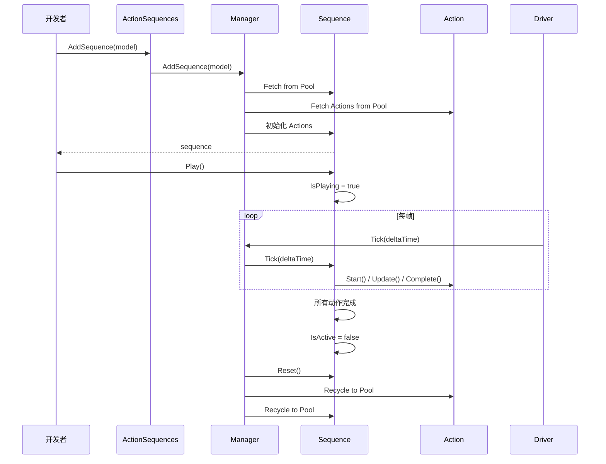

### 组件方式使用流程

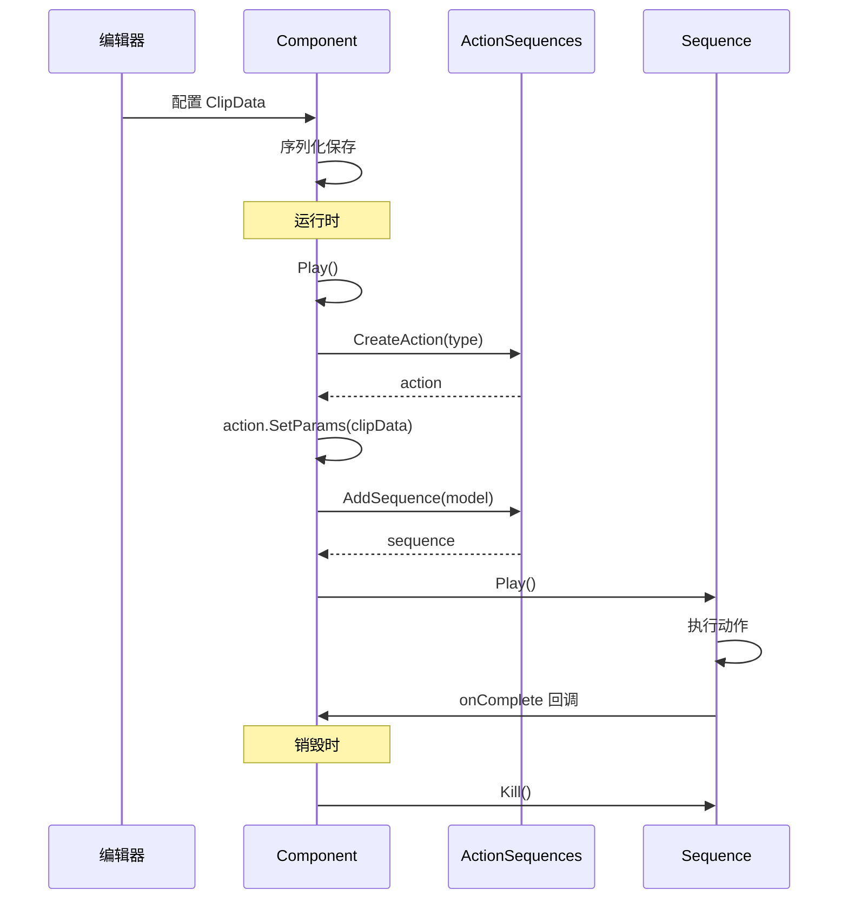

## 生命周期管理

### 系统初始化

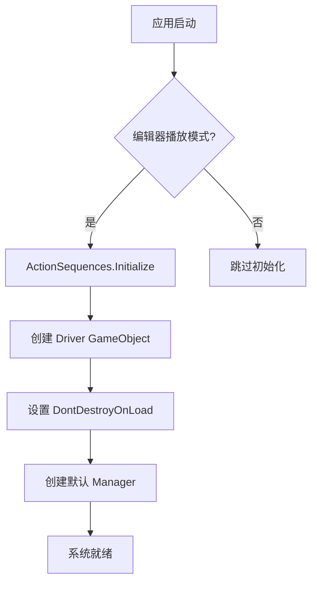

### 序列生命周期

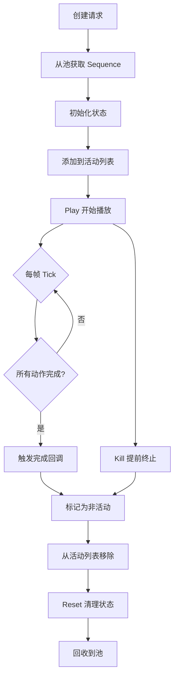

### 动作生命周期

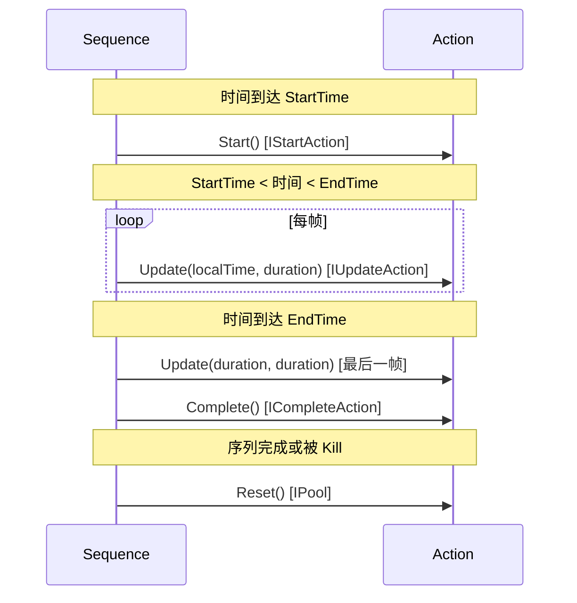

## 扩展机制

### 自定义动作开发流程

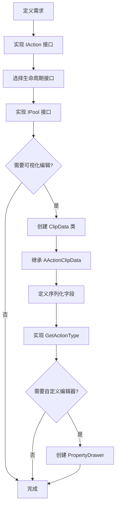

### 扩展点总结

| 扩展点 | 接口/基类 | 用途 |
|--------|-----------|------|
| **自定义动作** | IAction 接口族 | 实现特定功能的动作 |
| **可视化数据** | AActionClipData | 在编辑器中配置动作 |
| **扩展方法** | static class | 为组件添加便捷方法 |
| **自定义管理器** | ActionSequenceManager | 创建专用的序列管理 |
| **编辑器扩展** | PropertyDrawer | 自定义编辑器界面 |

## 性能优化策略

### 内存优化

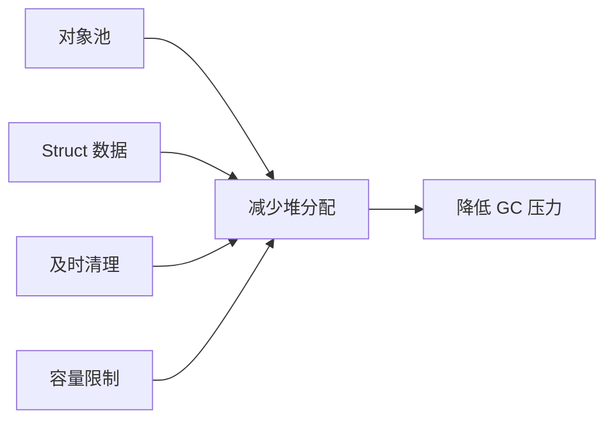

**具体措施**:
- ✅ 所有频繁创建的对象使用对象池
- ✅ ActionClip 和 Model 使用 struct
- ✅ 自动回收非活动序列
- ✅ 对象池容量限制（1000）

### CPU 优化

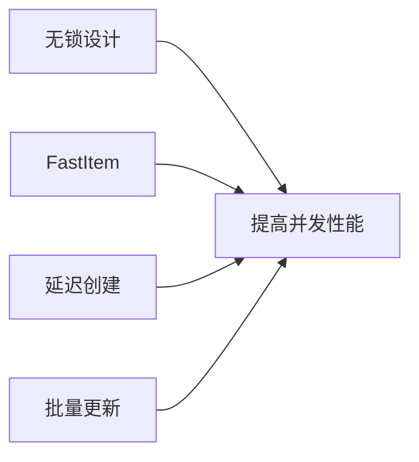

**具体措施**:
- ✅ 对象池使用 CAS 无锁实现
- ✅ FastItem 提供快速访问路径
- ✅ 组件按需创建序列
- ✅ Manager 统一 Tick 更新

### GC 优化

**减少 GC 的设计**:
- 对象池复用，减少临时对象
- 避免装箱（使用泛型）
- 谨慎使用闭包和 lambda
- Reset 中清除所有引用

### 性能监控建议

```csharp
// 监控活动序列数量
int activeSequences = manager.GetActiveSequenceCount();

// 监控对象池使用情况
int pooledObjects = manager.GetPooledObjectCount<MyAction>();

// 监控内存分配
// 使用 Unity Profiler 的 Memory 和 GC Alloc 视图
```

## 总结

ActionSequence 系统通过精心设计的三层架构，实现了以下目标：

### 架构优势

1. **清晰的职责分离**: 核心层、集成层、扩展层各司其职
2. **高度可扩展**: 基于接口的设计，支持无限扩展
3. **性能优化**: 对象池、无锁设计、内存优化
4. **易于使用**: 简洁的 API，可视化编辑
5. **深度集成**: 与 Unity 生命周期完美配合

### 适用场景

- ✅ 复杂动画序列编排
- ✅ UI 动态效果和交互
- ✅ 游戏技能和事件系统
- ✅ 过场动画控制
- ✅ 任何需要精确时间控制的场景

### 设计原则

- **接口驱动**: 最大化灵活性和可扩展性
- **自动化管理**: 简化用户代码，减少错误
- **性能优先**: 对象池、无锁、零 GC
- **开发者友好**: 直观的 API，完善的文档

---

**相关文档**:
- [API 参考](./api/README.md)
- [设计文档](./design.md)
- [快速入门](./getting-started.md)
- [示例代码](./examples/README.md)
